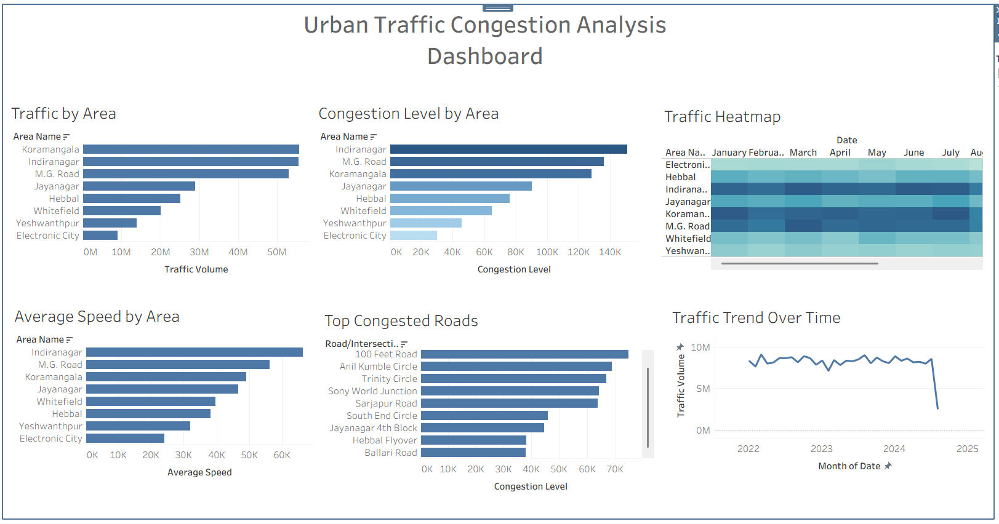

# Urban Traffic Congestion Analysis Dashboard

## Overview

The Urban Traffic Congestion Analysis Dashboard is an interactive Tableau project designed to analyze traffic patterns, congestion levels, road performance, and vehicle movement trends across major urban areas.

The dashboard provides a comprehensive view of traffic conditions by combining traffic volume, congestion levels, average vehicle speed, road bottlenecks, and temporal traffic trends into a single analytical platform.

This project aims to support data-driven decision-making for urban planning, traffic management, and transportation optimization.

---

## Problem Statement

Rapid urbanization has led to increased traffic congestion in metropolitan areas, resulting in:

- Increased travel time
- Reduced road efficiency
- Higher fuel consumption
- Environmental impacts
- Poor commuter experience

This project analyzes urban traffic data to identify congestion hotspots, high-risk roads, and traffic trends that can help improve transportation planning.

---

## Objectives

- Analyze traffic volume across different urban locations.
- Identify areas experiencing the highest congestion.
- Monitor average vehicle speed across locations.
- Detect highly congested roads and intersections.
- Visualize traffic trends over time.
- Provide actionable insights for traffic management.

---

## Tools & Technologies

- Tableau Public
- Microsoft Excel
- Data Visualization
- Data Analytics

---

## Dashboard Components

### 1. Traffic by Area

Displays total traffic volume across major city locations.

**Key Observations:**
- Koramangala, Indiranagar, and M.G. Road record the highest traffic volumes.
- Electronic City experiences comparatively lower traffic flow.

---

### 2. Congestion Level by Area

Compares congestion intensity across locations.

**Key Observations:**
- Indiranagar exhibits the highest congestion level.
- M.G. Road and Koramangala are also highly congested zones.
- Electronic City has the lowest congestion score.

---

### 3. Traffic Heatmap

Provides month-wise congestion intensity across locations using color gradients.

**Insights:**
- High-density traffic zones remain consistently congested throughout the year.
- Seasonal fluctuations can be observed across multiple areas.

---

### 4. Average Speed by Area

Analyzes average vehicle speed in different locations.

**Insights:**
- Areas with high congestion generally report lower vehicle speeds.
- Electronic City shows lower traffic volume but also relatively lower average speed, indicating possible infrastructure constraints.

---

### 5. Top Congested Roads

Ranks roads and intersections based on congestion levels.

**Most Congested Roads:**
- CMH Road
- 100 Feet Road
- Anil Kumble Circle
- Trinity Circle
- Sony World Junction

These locations may require traffic management interventions.

---

### 6. Traffic Trend Over Time

Tracks traffic volume changes over multiple years.

**Insights:**
- Traffic volume remains consistently high over the observed period.
- Temporary fluctuations indicate changing travel patterns and demand.

---

## Key Business Insights

### High Traffic Zones
Koramangala, Indiranagar, and M.G. Road are major traffic hubs and experience the highest traffic volumes.

### Congestion Hotspots
Indiranagar consistently records the highest congestion levels, making it a critical focus area for traffic optimization.

### Road Bottlenecks
Several intersections repeatedly appear among the most congested roads, suggesting infrastructure limitations or signal inefficiencies.

### Traffic Speed Analysis
Average speed decreases significantly in areas with higher congestion, affecting commuter efficiency.

### Long-Term Trends
Traffic demand remains stable at a high level, indicating the need for scalable transportation solutions.

---

## Dashboard Preview

---

## Potential Applications

- Smart City Planning
- Traffic Management Systems
- Urban Infrastructure Development
- Route Optimization
- Transportation Analytics
- Public Policy Decision-Making

---

## Future Enhancements

- Real-time traffic data integration
- Predictive congestion forecasting using Machine Learning
- Weather and traffic correlation analysis
- Interactive geographic maps
- Route recommendation system

---

## Project Files

- Urban_Traffic_Congestion_Analysis.twbx
- dashboard_preview.png
- dataset.csv

---

## Author

**Zafar Ahmad**

B.Tech Computer Science & Engineering

Aspiring Data Analyst | SQL | Python | Excel | Tableau | Power BI
